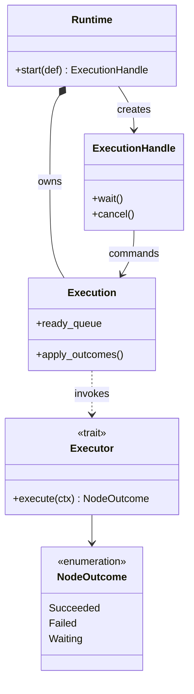
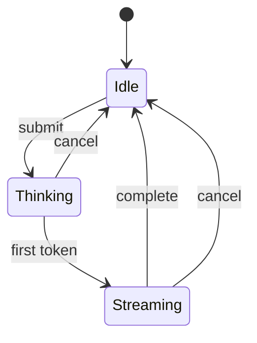
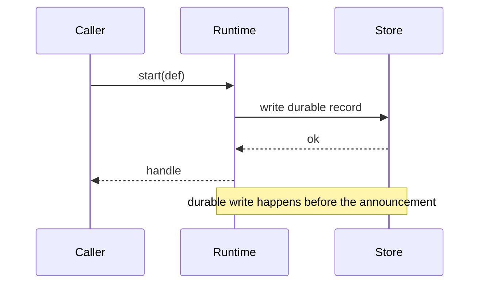
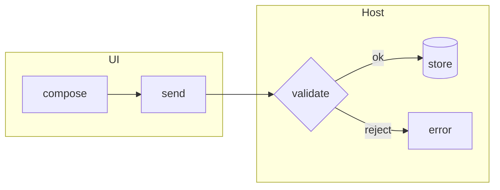
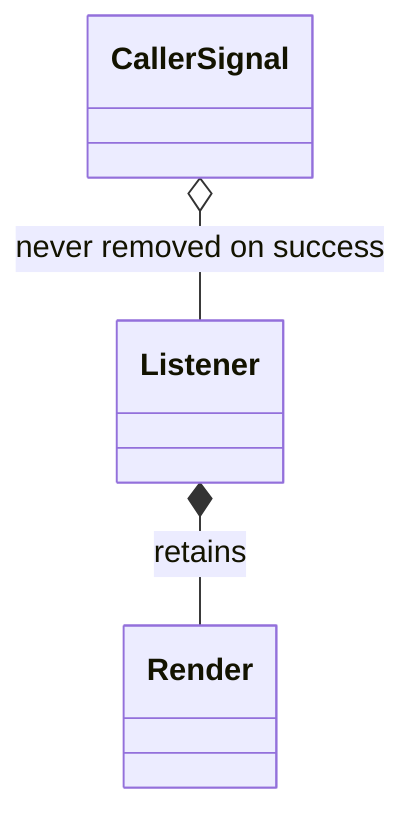
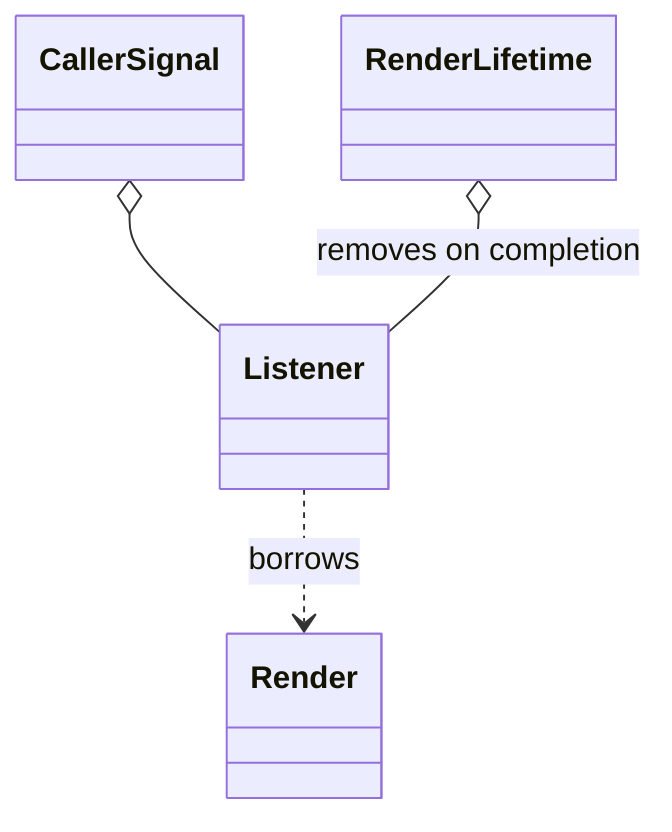

# Diagrams in pull requests

A change that alters a *shape* — a structure, a state machine, a control flow,
an ownership or lifetime relationship — is much cheaper to review with a picture
than without one. A change that alters a value or fixes an off-by-one is not.
Know which you have.

GitHub renders [mermaid](https://mermaid.js.org) in issues, pull requests,
discussions, wikis, and Markdown files, from a fenced block tagged `mermaid`.
That means the diagram lives in the description as text: diffable, editable by
a reviewer, and never a stale image nobody can regenerate.

---

## When a diagram earns its place

Draw one when the change alters:

- **Ownership or lifetime** — who holds what, who may outlive whom, what keeps
  what alive. This is the highest-value case, because it is the hardest to see
  in a diff.
- **The type graph** — a trait extracted, a struct split, a dependency
  inverted, a layer introduced or removed.
- **A state machine** — new states, changed transitions, a state that used to be
  reachable and is not.
- **Control or data flow** — a call became an event, a synchronous path became
  queued, a step moved to the other side of a boundary.
- **A lock or async ordering** — what happens concurrently, and in what order.

Do **not** draw one for: a value change, a rename, a bug fix that does not move
a boundary, or "here is the whole architecture" on a change that touches one
corner of it.

## Rules

**Prose first, diagram second.** The diagram illustrates a claim; it does not
make one. A diagram with no sentence saying what to notice is decoration.

**Diagram only the changed region**, plus one hop of context on each side. A
diagram of the whole system hides the change inside it. If the reviewer cannot
find the delta in under five seconds, the diagram is too big.

**Same nodes, same layout, in both diagrams.** The *only* differences between
Before and After should be the ones the change makes. If you also rename nodes,
reorder them, or add detail on one side, the reader cannot diff them by eye and
the pair is worse than one diagram.

**Stack them, do not try to place them side by side.** A fenced block cannot
live inside a Markdown table cell, so the two-column layout people reach for
does not render. Use `### Before` and `### After` headings, one after the other.

**Ten to fifteen nodes, maximum.** Past that, split into two diagrams by concern
or drop to the level above.

**No hardcoded colours.** Readers are on light and dark themes; a fill that
looks right for you is unreadable for half of them. Use shape, arrow style, and
grouping to carry meaning. If you must emphasise, do it in one place only.

**Preview before you post.** Push the description into a draft or a comment on
your own fork and look at it. A syntax error renders as a raw code block, and a
mermaid diagram that fails to parse is worse than none.

**Collapse the large ones.** Wrap a big diagram in `<details><summary>` so the
description stays readable, with a blank line after the `<summary>` line.

---

## Class diagram

For structure, ownership, and dependency direction. This is the one to reach for
when a refactor moves responsibility between types.

````markdown

````

### Syntax you need

| Want | Write | Means |
| --- | --- | --- |
| Association | `A --> B` | A refers to B |
| Dependency | `A ..> B` | A uses B transiently — a parameter, a return, a call |
| Composition | `A *-- B` | B cannot outlive A. **Use this for ownership** |
| Aggregation | `A o-- B` | A holds B, but B exists independently |
| Inheritance / impl | `B --\|> A` | B is an A. Arrow points at the parent |
| Label | `A --> B : owns` | Name the relationship |
| Cardinality | `A "1" --> "*" B` | Quoted, on each side of the arrow |
| Stereotype | `<<trait>>` `<<interface>>` `<<enumeration>>` `<<abstract>>` | Inside the class body or on its own line |
| Note | `note for A "…"` | Sparingly |

**Composition versus association is the whole point of the diagram.** `*--` says
*this is a lifetime relationship*; `-->` says *this is a reference*. Getting that
distinction right is most of the value, and it is exactly what a diff cannot
show.

Show only the members relevant to the change. A class box listing every field is
a class box nobody reads.

## State diagram

For a lifecycle, a status enum, or anything with legal and illegal transitions.

````markdown

````

The most useful thing a Before/After pair does here is show a transition that
**used to exist and no longer does** — the reachable-but-illegal state you just
removed. Say that in the prose above it.

## Sequence diagram

For ordering, especially across a boundary or between threads. The one case
where it beats everything else: showing the interleaving that causes a race.

````markdown

````

Use `Note over` to mark the invariant, and `activate`/`deactivate` when a lock
or a hold is what the change is about.

## Flowchart

For control flow and data flow. Use it when the change moves a step across a
boundary or replaces a call with an event.

````markdown

````

`subgraph` is how you show a boundary being crossed, which is usually the point.
`LR` reads better than `TD` for pipelines; `TD` for hierarchies.

---

## A worked Before/After

````markdown
### Before

The listener was registered on the caller's signal and only removed from inside
itself. On the success path the signal never fires, so the closure kept the
whole finished `Render` reachable for as long as the caller held the signal.



### After

The listener is bound to a lifetime that ends when the render completes, so the
runtime removes it and nothing has to remember to.


````

Note what makes the pair work: identical node names, one structural difference,
and a sentence above each saying what to look at. The retention relationship
changed from `*--` to `..>`, and that single arrow change *is* the fix.
