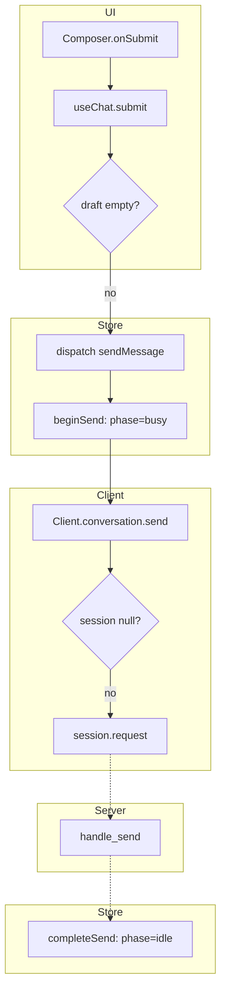

# Trace format

Worked shapes for the `trace` skill. The procedure and the line forms live in
[`SKILL.md`](../SKILL.md); this file is only the picture. The example below
was produced against a real repository at a fixed revision and is here to
show the shape. It is not a trace of that repository today; regenerate before
relying on any hop in it.

---

## ASCII, debugging mode

A blocking pool: the caller pushes a task under one mutex and either wakes an
idle worker or spawns a thread; the worker pops under the same mutex. The
symptom: a task is queued but never runs.

```text
# Trace: spawn_blocking(f) → f runs on a blocking-pool thread
Entry: task::spawn_blocking(f)                          src/task/blocking.rs:220
Question: debugging — the JoinHandle for f is never woken; no error, no panic
Source: tokio @ cf782c5; external: none walked (std Mutex/Condvar via loom shim)

spawn_blocking pushes one Task into one queue behind one mutex. Under that
lock the pusher either wakes an idle worker (notify_one, guarded by a
num_notify counter so the wake cannot be lost) or spawns a thread, unless the
pool is at thread_cap, in which case it does neither and the task waits for
some running worker to finish and loop back to pop. That "someone will pop it"
assumption is the load-bearing decision; a worker that never returns from f
turns "queued" into "queued forever".

Mechanisms considered: M1 lost wake-up between notify and wait  M2 pool at cap
with every worker blocked  M3 thread spawn fails and nothing retries  M4 shutdown
cancels or drops queued work

## Common prefix

|
|  [ blocking::pool · thread: caller ]
|     spawn_blocking(f)                              src/task/blocking.rs:220
|-----> Handle::spawn_blocking … Spawner::spawn_task (via runtime::spawn_blocking, spawn_blocking_inner)
|                                                    src/runtime/blocking/pool.rs:246 … :459
|   // state: task = unowned(BlockingTask(f)); JoinHandle minted here   pool.rs:452
|-----> LockedImpl::spawn_task                       pool.rs:611
|   +lock mutex                                      pool.rs:620
|   ? thread_mgmt_state.shutdown   → A | Q            pool.rs:622

## Path A — shutdown already begun, from ? shutdown == true

|-----> task.shutdown()                              pool.rs:626
|   -lock mutex
|<----- return Err(ShuttingDown)                     pool.rs:627
Not the symptom: the JoinHandle resolves with JoinError::cancelled.

## Path Q — task accepted, from ? shutdown == false

|-----> queue.push_back(task)                        pool.rs:630
|   // state: queue_depth += 1                       pool.rs:631
|   ? num_idle_threads() == 0      → Q1 | Q2          pool.rs:633

### Path Q1 — no idle worker

|-----> on_no_idle                                   pool.rs:634 → :476
|   ? num_threads() == thread_cap  → AT-CAP | BELOW   pool.rs:479
|
|  AT-CAP:
|   -lock mutex                                      pool.rs:646
|   !! S1 nothing is notified and nothing is spawned; the task depends on a
|      running worker reaching pop_front again        pool.rs:479-482
|
|  BELOW:
|-----> spawn_thread(shutdown_tx, rt, id)             pool.rs:490 → :516
|   ? spawn result   → Ok | WouldBlock ∧ peers > 0 | other   pool.rs:491,496,504
|   Ok:      // state: num_threads += 1; worker_threads[id] = handle   pool.rs:492-494
|            -lock mutex
|            ~~~> OS thread starts        ==> [thread: worker]           pool.rs:530
|   WouldBlock ∧ peers > 0:
|            -lock mutex
|            !! S2 same outcome as S1 by a different gate: queued, no thread, no notify   pool.rs:496-503
|   other:   return Err(NoThreads) → panic in caller   pool.rs:507, :394   (not the symptom)

### Path Q2 — idle worker exists

|   // state: num_idle_threads -= 1; num_notify += 1   pool.rs:641-642
|   ~~~> condvar.notify_one           ==> [thread: worker]   pool.rs:643
|   -lock mutex                                       pool.rs:646

## Worker spine

|
|  [ blocking::pool · thread: worker ]
|     Inner::run → LockedImpl::run_worker             pool.rs:763 → :650
|   +lock mutex                                       pool.rs:656
|-----> BUSY: queue.pop_front()                       pool.rs:663
|   -lock mutex
|-----> task.run()   [opaque: user code f; may block or re-enter the runtime]   pool.rs:666
|   +lock mutex                                       pool.rs:668
|<----- loop to pop_front                             advances while the queue is non-empty
|   // state: num_idle_threads += 1; is_counted_idle = true   pool.rs:672-674
|=====> condvar.wait_timeout   WAITS: until notify or keep_alive (releases mutex; reacquires on wake)   pool.rs:677
|   ? num_notify != 0    → NOTIFIED | TIMED-OUT        pool.rs:682-697
|   NOTIFIED:  // state: num_notify -= 1               pool.rs:686
|              <----- loop to pop_front
|   TIMED-OUT: // state: worker removed; num_threads -= 1   pool.rs:698-743
|              thread exits; the pool re-climbs from zero on the next burst

## Actor — runtime shutdown

|
|  [ BlockingPool::shutdown · thread: whoever drops the Runtime ]
|-----> begin_shutdown                                pool.rs:748
|   +lock mutex
|   // state: shutdown = true; shutdown_tx = None     pool.rs:750
|   ~~~> condvar.notify_all         ==> [thread: every idle worker]   pool.rs:751
|   -lock mutex
|=====> shutdown_rx.wait(timeout)   WAITS: until every worker's Inner::run returns   pool.rs:332
|
|  [ blocking::pool · thread: worker ]  (after NOTIFIED/TIMED-OUT with shutdown set)
|-----> while queue.pop_front()                       pool.rs:708
|   ? task.mandatory   → run it | task.shutdown()      pool.rs:712
Queued work is run (mandatory) or cancelled (not), never dropped silently. A
worker wedged inside f also wedges an untimed shutdown.

Omitted: sharded queue (opt-in build; structurally different, same at-cap class).

## Suspects

S1 Pool at thread_cap with every worker inside a blocked f, at on_no_idle
   pool.rs:479-482. Produces the symptom whenever no worker returns to
   pop_front. Matches "under load with file I/O".
   Probe: dump all thread backtraces; if every blocking thread is in user code
   and none in Condvar::wait_timeout at pool.rs:677, this is it.
S2 Thread creation fails with WouldBlock while peers exist, pool.rs:496-503.
   Same outcome via ulimit or PID pressure.
   Probe: strace -f -e trace=clone for EAGAIN during the load test.

Ruled out: M1 lost wake-up. notify_one (pool.rs:643) and the num_notify check
(pool.rs:682) both run under the same mutex, and wait_timeout releases and
reacquires that mutex atomically, so a timeout cannot beat a notify.

## Invariants to assert
- Every push_back (pool.rs:630) is followed in the same critical section by
  exactly one of on_no_idle (pool.rs:634) or notify_one (pool.rs:643).
- num_idle_threads changes only at pool.rs:641, 672, 729, each under mutex.

## Where a test goes
- tests/rt_blocking_thread_exhaust.rs, beside the existing exhaustion test:
  max_blocking_threads(1); first closure parks on a channel that is never sent
  to; assert the second JoinHandle does not resolve while
  num_blocking_threads() == 1, then send, then assert it resolves. That
  controls the at-cap transition rather than waiting on a timer.

## Gaps
- Why a given f never returns is the user's code, outside this repo.
- Which waiter notify_one wakes is the platform's condvar; any waiter suffices.
```

What to notice: the prefix is written once and ends at the first decision;
each path is named by its predicate; the worker is its own spine joined by
`~~~>`; the wait line says which lock it releases; shutdown is an actor, not a
path; plumbing between `spawn_blocking` and `spawn_task` is one collapsed
line; the ending is four sections and a ruled-out mechanism with its evidence.

---

## ASCII, understanding mode

Same line forms, every branch as a path, and only `## Gaps` at the end.

```text
# Trace: submit a chat message
Entry: Composer.onSubmit                              ui/composer.tsx:41
Question: understanding
Source: app @ 3f2c1a9

The draft goes store → client → websocket → server and back; the store marks
the turn busy before the request and idle after the reply or the failure.

## Common prefix

|
|  [ UI ]
|     Composer.onSubmit                                ui/composer.tsx:41
|-----> useChat.submit                                 ui/use-chat.ts:22
|   ? draft.trim() === ""          → B | A              ui/use-chat.ts:24

## Path A — non-empty draft

|
|  [ Store ]
|-----> dispatch(sendMessage)                          store/chat.ts:80
|   // state: transcript += user turn; phase = busy    store/chat.ts:88
|
|  [ Client ]
|-----> Client.conversation.send                       client/conversation.ts:15
|   ? session == null              → C | continue       client/conversation.ts:17
|-----> session.request("conversation.send")           client/session.ts:60
|   ~~~> WebSocket request         ==> [process: server]
|
|  [ Server ]
|-----> conversation::handle_send                      server/conversation.rs:120
|   ~~~> WebSocket response        ==> [process: client]
|
|  [ Store ]
|-----> completeSend                                   store/chat.ts:104
|   // state: transcript += reply; phase = idle

## Path B — empty draft, from ? draft.trim() === ""

|-----> early return                                   ui/use-chat.ts:25

## Path C — not connected, from ? session == null

|-----> sendMessage.rejected                           store/chat.ts:112
|   // state: keep user turn; error shown; phase = idle

## Gaps
- The server handler dispatches on a trait object at server/conversation.rs:131;
  candidates: EchoBackend, ModelBackend.
```

---

## Mermaid (when allowed)

Same hops as `flowchart TB`, one subgraph per layer, decisions as diamonds,
handoffs as dashed edges, node text as code symbols. Prose header first.

````markdown
# Trace: submit a chat message · Path A


````

Paths B and C are separate diagrams, not hidden branches inside Path A.

---

## What not to do

- Do not collapse failure paths into a footnote on the happy path.
- Do not use remembered traces from an earlier session, including the example
  above.
- Do not invent hops past a stub; write a `gap:` line.
- Do not mark every state write; mark the ones that gate the observable.
- Do not put a mechanism you have ruled out in the ranked suspects.
- Do not default to printing ASCII and mermaid together.
