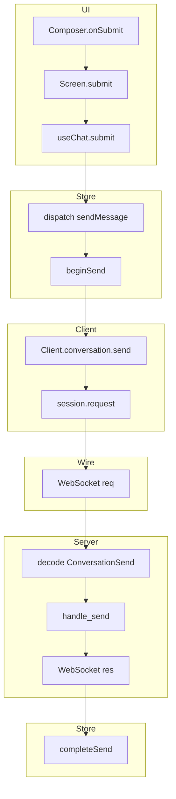

# Trace format

Worked shapes for the `trace` skill. The procedure lives in
[`SKILL.md`](../SKILL.md); this file is only the picture.

---

## ASCII — layered call order

Depth follows call order. Boxes group one architectural layer. Arrows are the
next hop. `//` is a side effect (state, UI, I/O), not another call.

```text
# Trace: submit a chat message
Entry: Composer.onSubmit
Source: live from repo (not cached)

## Path A — connected, non-empty draft

|
|  [ UI ]
|     Composer.onSubmit
|-----> Screen.submit
|-----> useChat.submit                 // read draft + active id
|
|  [ Store ]
|-----> dispatch(sendMessage)
|-----> beginSend                      // append user turn, phase: busy
|         Transcript ← user text + pending
|
|  [ Client ]
|-----> getSession()
|-----> Client.conversation.send
|-----> session.request("conversation.send", { text })
|
|  [ Wire ]
|-----> WebSocket request → server
|
|  [ Server ]
|-----> decode → ConversationSend
|-----> conversation::handle_send
|-----> WebSocket response { text }
|
|  [ Store ]
|-----> completeSend                   // mark delivered, append reply, idle
|         Transcript ← user + assistant

## Path B — empty draft (no RPC)

|
|  [ UI ]
|     useChat.submit
|-----> early return                   // trim empty → no dispatch

## Path C — not connected / request fails

|
|  … same through dispatch(sendMessage)
|-----> getSession() null | request errors
|-----> sendMessage.rejected
|-----> failSend                       // keep user turn, show error, idle
```

Replace layer names and symbols with whatever the repo actually uses. The
shape stays the same.

---

## Mermaid — same hops (UI surfaces only)

Use only when the skill's render rules allow mermaid. One subgraph per layer;
node text = code symbols.

````markdown
# Trace: submit a chat message · Path A


````

Path B and Path C are separate diagrams (or separate ASCII trees), not hidden
branches inside Path A.

---

## What not to do

- Do not collapse failure paths into a footnote on the happy path.
- Do not use remembered traces from an earlier session.
- Do not invent hops past a stub; mark the gap in one line under the tree.
- Do not default to printing ASCII and mermaid together.
